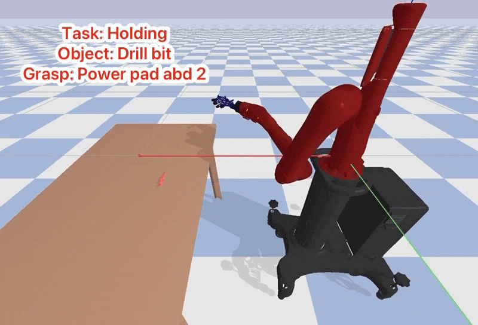
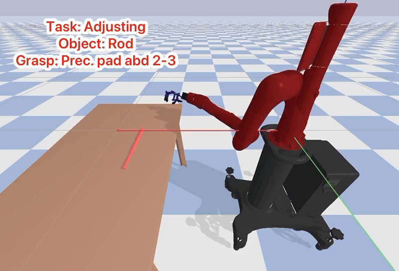
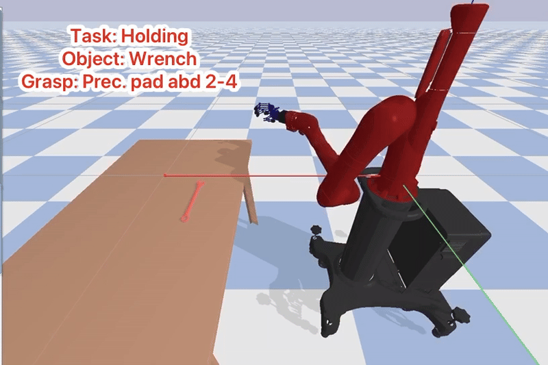
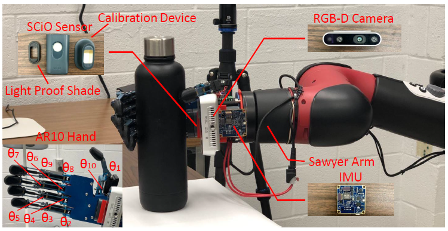
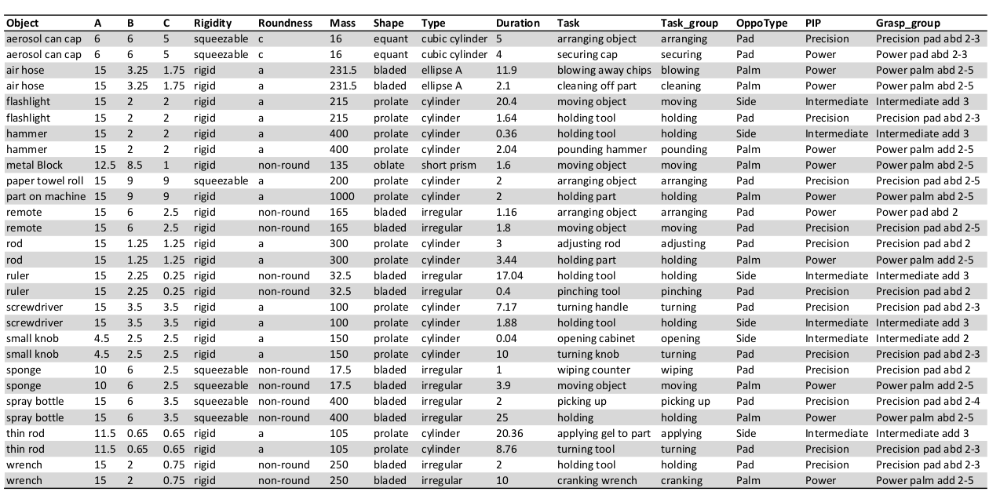

# Overview

This repository includes the simulation environment for the MagicHand platform, a task-object grasp dataset, and the source code for two reinforcement learning models designed for object manipulation tasks.

 

If you find this environment helpful, please consider cite

    @inproceedings{li2020magichand,
      title={MagicHand: Context-Aware Dexterous Grasping Using an Anthropomorphic Robotic Hand},
      author={Li, Hui and Tan, Jindong and He, Hongsheng},
      booktitle={2020 IEEE International Conference on Robotics and Automation (ICRA)},
      pages={9895--9901},
      year={2020},
      organization={IEEE}
    }

# MagicHand
The MagicHand platform is a context-aware dexterous manipulation system comprising a Sawyer robotic arm and an AR10 robotic hand. It integrates multiple sensors, including a RealSense RGB-D camera, a SCiO sensor for near-infrared (NIR) perception, and an inertial measurement unit (IMU).

 

The simulation environment is developed using PyBullet within the Gym framework. It supports reinforcement learning and enables a range of applications, including object alignment, pick-and-place, and dexterous manipulation tasks.

# Task-Oriented Objects Dataset
This dataset was revised from the Yale human grasping dataset. It contains human knowledge representation of 6554 grasping tasks.

 

# Publications

This platform is used in the following papers

## Grasp Intention Interpretation in Object Handover for Human-Robot Teaming

    @inproceedings{li2024grasp,
    title={Grasp Intention Interpretation in Object Handover for Human-Robot Teaming},
    author={Li, Hui and Uz Zaman, Akhlak and He, Hongsheng},
    booktitle={International Conference on Social Robotics},
    pages={346--354},
    year={2024},
    organization={Springer}
    }
[[download paper](https://link.springer.com/chapter/10.1007/978-981-96-1151-5_35)]

## Knowledge Augmentation and Task Planning in Large Language Models for Dexterous Grasping

    @inproceedings{li2023knowledge,
    title={Knowledge Augmentation and Task Planning in Large Language Models for Dexterous Grasping},
    author={Li, Hui and Tran, Dang and Zhang, Xinyu and He, Hongsheng},
    booktitle={2023 IEEE-RAS 22nd International Conference on Humanoid Robots (Humanoids)},
    pages={1--8},
    year={2023},
    organization={IEEE}
    }

[[download paper](https://ieeexplore.ieee.org/document/10375176)]

## Learning Task-Oriented Dexterous Grasping from Human Knowledge

    @inproceedings{li2021learning,
      title={Learning Task-Oriented Dexterous Grasping from Human Knowledge},
      author={Li, Hui and Zhang, Yinlong and Li, Yanan and He, Hongsheng},
      booktitle={2021 IEEE International Conference on Robotics and Automation (ICRA)},
      pages={6192--6198},
      year={2021},
      organization={IEEE}
    }
[[download paper](https://ieeexplore.ieee.org/abstract/document/9562073)]

## MagicHand: Context-Aware Dexterous Grasping Using an Anthropomorphic Robotic Hand
    @inproceedings{li2020magichand,
      title={MagicHand: Context-Aware Dexterous Grasping Using an Anthropomorphic Robotic Hand},
      author={Li, Hui and Tan, Jindong and He, Hongsheng},
      booktitle={2020 IEEE International Conference on Robotics and Automation (ICRA)},
      pages={9895--9901},
      year={2020},
      organization={IEEE}
    }
[[download paper](https://ieeexplore.ieee.org/document/9196538)]

## Learning robotic grasping strategy based on natural-language object descriptions
    @inproceedings{rao2018learning,
      title={Learning robotic grasping strategy based on natural-language object descriptions},
      author={Rao, Achyutha Bharath and Krishnan, Krishna and He, Hongsheng},
      booktitle={2018 IEEE/RSJ International Conference on Intelligent Robots and Systems (IROS)},
      pages={882--887},
      year={2018},
      organization={IEEE}
    }
[[download paper](https://ieeexplore.ieee.org/document/8593886)]

## Magichand: In-hand perception of object characteristics for dexterous manipulation
    @inproceedings{li2018magichand,
      title={Magichand: In-hand perception of object characteristics for dexterous manipulation},
      author={Li, Hui and Yihun, Yimesker and He, Hongsheng},
      booktitle={Social Robotics: 10th International Conference, ICSR 2018},
      pages={523--532},
      year={2018},
      organization={Springer}
    }
[[download paper](https://link.springer.com/chapter/10.1007/978-3-030-05204-1_51)]